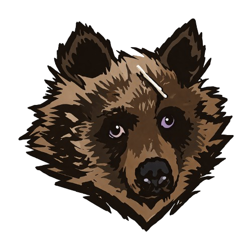

<div align="center">
    <h1>Logy</h1>
    
    <p>logy <i>/ˈloʊ.ɡi/</i> - feeling unwilling or unable to do anything or think clearly, usually because of tiredness</p>
</div>

***

## About the project
**Logy** is the result of numerous attempts to bring a single idea to life in various forms. In this case, the idea was to create a unified, user-friendly space for storing and tracking information about tested objects and completed scans.

Essentially, it is simply a wrapper around well-known tools for automating the collection, storage, and visualization of data generated during penetration testing. For more information please refer to the project [Wiki](https://github.com/indigo-sadland/logy/wiki).

## Installation
If you have recent go compiler installed use:
```
go install github.com/indigo-sadland/logy@latest
```
or build manually:
```
git clone https://github.com/indigo-sadland/logy
cd logy && go build -o logy main.go
```

`logy` depends on Go 1.26+.

## Required Tools
`logy` relies on external tools. The following binaries must be installed and available in `PATH` for the commands you use:

- Always required for normal discovery and resolution:
  - `dnsx`
- Required when the matching discovery provider is enabled:
  - `subfinder`
  - `amass`
  - `findomain`
- Required for bruteforce mode:
  - `puredns` + `massdns`
- Required for vhost resolution:
  - `VhostFinder`
- Required for permutation resolution:
  - `gotator`
- Required for port scanning:
  - `nmap`
- Required for terminal output recording:
  - `script`

> Also, if you want to experience export to **Anytype** you need to install it as well!
