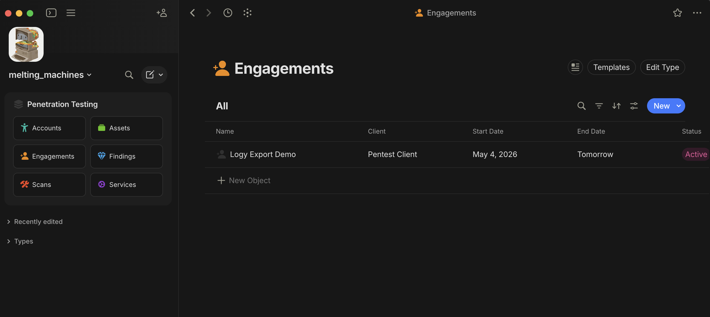

<div align="center">
    <h1>Logy</h1>
    
    <p>logy <i>/ˈloʊ.ɡi/</i> - feeling unwilling or unable to do anything or think clearly, usually because of tiredness</p>
</div>

## Required Tools
`logy` relies on external tools. The following binaries must be installed and available in `PATH` for the commands you use:

- Always required for normal discovery and resolution:
  - `dnsx`
- Required when the matching discovery provider is enabled:
  - `subfinder`
  - `amass`
  - `findomain`
- Required for bruteforce mode:
  - `puredns` + `massdns`
- Required for vhost resolution:
  - `VhostFinder`
- Required for permutation resolution:
  - `gotator`
- Required for port scanning:
  - `nmap`
- Required for terminal output recording:
  - `script`

> Also, if you want to experience export to **Anytype** you need to install it as well!

## Installation
If you have recent go compiler installed use:
```
go install github.com/indigo-sadland/logy@latest
```
or build manually:
```
git clone https://github.com/indigo-sadland/logy
cd logy && go build -o logy main.go
```

`logy` depends on Go 1.26+.

### Configuration
#### Anytype
If you intended to use export to **Anytype** then you need to import `anytype_template.zip` data into your Anytype's vault.\

The archive data is a bunch of json files that were exported from Anytype so you don't need to manually create all the necessary 
object and properties.\

To import zip file in **Anytype** navigate to `File -> Import to Space` in `By App` category click on `Anytype` and select the zip file.\
After the import you'll get "Penetration Testing" collection object:


#### Logy
By default, `logy` reads its config from:
```
~/.config/logy/config.yaml
```

If you want to you can override it for any command with:
```
logy ... --config /path/to/config.yaml
```

### Active Scope
You can persist the current domain scope in:
```
~/.config/logy/state.yaml
```

Commands that use `--domain` also fall back to the active scope when the flag is omitted. Explicit `--domain` still wins for that invocation.

```
logy scope set example.com
logy scope show
logy scope clear
```

#### Encrypted Secrets
For now, encrypted secrets hold sensitive values such as `bufferover api key`, and anytype's `space id` and `vaults api`
using age-encrypted secrets file with passphrase:
```
~/.config/logy/secrets.json.age
```

To set secrets use the following commands :
```
logy secrets set bufferover
logy secrets set anytype
logy secrets status
```

`LOGY_SECRETS_PASSPHRASE` environmental variable can provide the passphrase for non-interactive runs. If it is not set, `logy` prompts only when a command needs encrypted secrets. Plain config values such as `discovery.tool_config.bufferover.api_key` still work as a backward-compatible fallback but **soon will be removed!**

## Subdomain Discovery
### Passive mode
- General
```
logy domain enum -d example.com
logy scope set example.com
logy domain enum
```
- PTR records
```
logy domain enum --asn AS3333 [--domain-filter example.com]
```

### Bruteforce mode
```
logy domain brute -d example.com -w wordlist.txt -r resolvers.txt
logy domain brute -w wordlist.txt -r resolvers.txt
```
This runs `puredns` as a dedicated bruteforce phase and stores the results in the same domain state.

### Resolution Enrichment
By default, after passive and active subdomain discovery, `logy` automatically resolves discovered hosts. If unresolved subdomains remain, you can try vhost resolution.
#### VHost
Uses unresolved confirmed subdomains plus unresolved permutation candidates as the wordlist, and IPs from already resolved subdomains as the target IP set.
```
logy domain resolve vhost -d example.com
logy domain resolve vhost
```
Newly resolved confirmed subdomains will be saved in DB overwriting unresolved status. Successfully matched permutation candidates are promoted into the main subdomain table.

#### Permutation
Uses all discovered subdomains from the database as the seed set for `gotator`,
then resolves only newly generated candidates. DNS-resolved results are stored as confirmed subdomains; unresolved results are kept in a separate candidate pool for later vhost follow-up instead of polluting the main subdomain table.
```
logy domain resolve permute -d example.com -p permutations.txt
logy domain resolve permute -p permutations.txt
```

### Check results
To get data from the database, use the `show` subcommand:
```
logy domain show -d example.com
logy domain show
```
This command returns all unique subdomain records for the given root domain.

To inspect unresolved permutation candidates kept outside the main subdomain table:
```
logy domain candidates show -d example.com
logy domain candidates show
```

### Import saved targets
You can also import line-delimited targets into a domain scope:
```
logy domain import -d example.com -f targets.txt
logy domain import -f targets.txt
```
Each line may be one of:
- `host`
- `ip`
- `host,ip1,ip2`

Plain hostnames are automatically resolved after import using the configured resolver.
Bare IP lines and `host,ip1,ip2` lines are stored under the selected domain as already-resolved records.

---
## Port Scanning
### Raw nmap proxy mode
Passes arguments directly to `nmap`.
```
logy portscan -- -Pn -sV scanme.nmap.org
```
In this mode, `logy` only prints `nmap` output to the terminal and does not save data in the database.

To persist open-port results from a raw scan, provide a domain label:
```
logy portscan --save-domain mytarget.com -- -Pn -sV scanme.nmap.org
```
Add `--save-temp-file` if you also want to keep the captured XML in a temp file.

#### Scan resolved IPs from DB
Loads unique resolved IPs for the provided root domain from the database, scans them with `nmap`, and stores open ports in the database.
```
logy portscan --from-db example.com -- -Pn -sV -p 80,443
logy portscan --from-db -- -Pn -sV -p 80,443
```
`--save-temp-file` works here as well and preserves the captured XML result under the system temp directory.

#### Interactively pick one saved target from DB
Loads saved scan targets for the provided root domain from the database, opens an interactive filterable picker, then scans only the selected target with `nmap`.
```
logy portscan pick -d example.com -- -Pn -sV
logy portscan pick -- -Pn -sV
```
The picker includes both hostname-backed targets and IP-only assets already saved under the selected domain label, which makes it usable for internal pentests and asset-only scopes.
Type to filter by hostname or IP, use `Up`/`Down` or `j`/`k` to move, `Enter` to scan, and `Ctrl+C` to cancel.

#### Scan one saved target from DB in non-interactive mode
Same behavior as in `pick` but you need manually set target.
```
logy portscan --domain example.com --target api.example.com -- -Pn -sV
logy portscan --domain example.com --target 10.10.20.44 -- -Pn -sV
logy portscan --target api.example.com -- -Pn -sV
```
This mode is intended for scripts and non-interactive shells. The target must match an existing saved hostname-backed or IP-only target label exactly.

#### Show stored port scan results
Returns JSON grouped by scanned IP with related resolved subdomains and open ports.
```
logy portscan show -d example.com
logy portscan show
```
For one-line terminal output per IP:
```
logy portscan show -d example.com --format text
logy portscan show --format text
```

---
## Web Probing
### Raw httpx mode
Probe manually supplied targets from a file or piped stdin using `httpx -status-code -title -tech-detect`.
```
cat targets.txt | logy probe
logy probe --file targets.txt
```

Raw mode streams `httpx` output directly to the terminal by default. To persist raw probe results in the database, add `--save` and a root domain label:
```
logy probe --file targets.txt --save --domain example.com
logy probe --file targets.txt --save
```

### Automatic mode from saved recon data
Loads saved subdomains for the root domain, matches them against TCP HTTP/S-capable `portscan` results, probes the hostname targets with `httpx`, and stores the results in the database as historical records.
```
logy probe --domain example.com
logy probe
```

### Show stored probe results
Returns saved `httpx` probe history for a root domain as JSON, newest records first.
```
logy probe show -d example.com
logy probe show
```

---
## Command Tracking
Run external tools through `logy` to keep track of what was executed against each target.

`holdmy exec` streams the wrapped command's stdin/stdout/stderr normally, records the command line, target, tool, optional wordlist, status, timestamps, and exit code in the database. `--domain` is only the scope label for grouping runs. When `--target` is not provided, `logy` tries to infer the runtime target from common flags and positional arguments such as `ffuf -u ...`, `ssh root@host`, `scp file user@host:/path`, and plain IP/hostname arguments.

To capture the terminal session itself, add `--record-output`. In that mode `logy` runs the wrapped command through `script(1)`, writes the transcript under `~/.config/logy/transcripts/`, and links that file back to the stored command run metadata.

```
logy holdmy exec \
  --domain example.com \
  -- ffuf -u https://app.example.com/FUZZ -w /opt/wordlists/raft-small-words.txt

logy holdmy exec \
  -- ffuf -u https://app.example.com/FUZZ -w /opt/wordlists/raft-small-words.txt
```

Record an interactive transcript:
```
logy holdmy exec \
  --domain example.com \
  --record-output \
  -- nmap -Pn -sV 10.10.10.10
```

Use `--target`, `--wordlist`, or `--tool` when you want to override inferred metadata:
```
logy holdmy exec \
  --domain example.com \
  --target https://app.example.com/FUZZ \
  --wordlist words.txt \
  --tool ffuf \
  -- ffuf -u https://app.example.com/FUZZ -w words.txt
```

For commands where inference is ambiguous or not possible, set `--target` explicitly instead of relying on the domain label:
```
logy holdmy exec \
  --domain example.com \
  --target 10.10.10.10 \
  -- ssh root@10.10.10.10
```

Show tracked runs for a domain:
```
logy holdmy show -d example.com
logy holdmy show -d example.com --tool ffuf
logy holdmy show -d example.com --target https://app.example.com/FUZZ
logy holdmy show --tool ffuf
```
---
## Web UI
Serve a simple read-only dashboard over the local SQLite database.

```
logy serve --addr 127.0.0.1:8080
```
---
## Anytype Export
Push saved recon data into Anytype as Assets and Services linked to an existing Engagement.

The Engagement object must already exist in Anytype. `logy` looks it up by name, creates or reuses one Asset per resolved/scanned IP, merges related subdomains into the Asset `Alias` property, creates or reuses one Service per saved port scan linked to the IP Asset, and exports tracked command executions as Scan objects linked to the Engagement.

Export example command:
```
logy export anytype --domain example.com --engagement "Client Pentest 2026"
```

Before creating objects, `logy` prints the matched engagement ID, space ID, URL, and object counts, then asks for confirmation. Use `--yes` for non-interactive exports.

Service export searches both the current alias-based name and the IP fallback name before creating a Service, so a service exported before hostname discovery can still be reused later. Scan export uses `command_runs.command` as the Scan object name, maps `completed` to the `Completed` select value, maps every other command status to `Failed/Canceled`, writes `command_runs.started_at` into the `timestamp` text property, and writes recorded command output into the Scan object's markdown body as a fenced code block. To avoid duplicate Scan objects, Logy searches for an existing Scan with the same object name before creating one, verifies timestamp too when Anytype includes it in search results, and patches the markdown body on reruns when needed.

Default Anytype type keys are `engagements`, `assets`, `services`, and `scan`. If your Anytype keys differ, override them:
```
logy export anytype \
  --domain example.com \
  --engagement "Client Pentest 2026" \
  --engagement-type engagements \
  --asset-type assets \
  --service-type services \
  --scan-type scan
```

Default property keys are `alias`, `engagement`, `asset`, `port`, `state`, `service`, `banner`, `scan_status`, and `timestamp`; each has a matching `--*-property` flag.

The export is push-only. It's capable to deduplicate and merge with existing Anytype objects.
